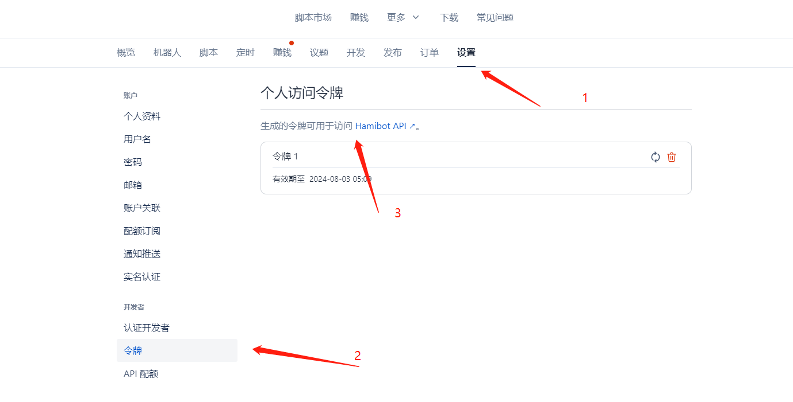
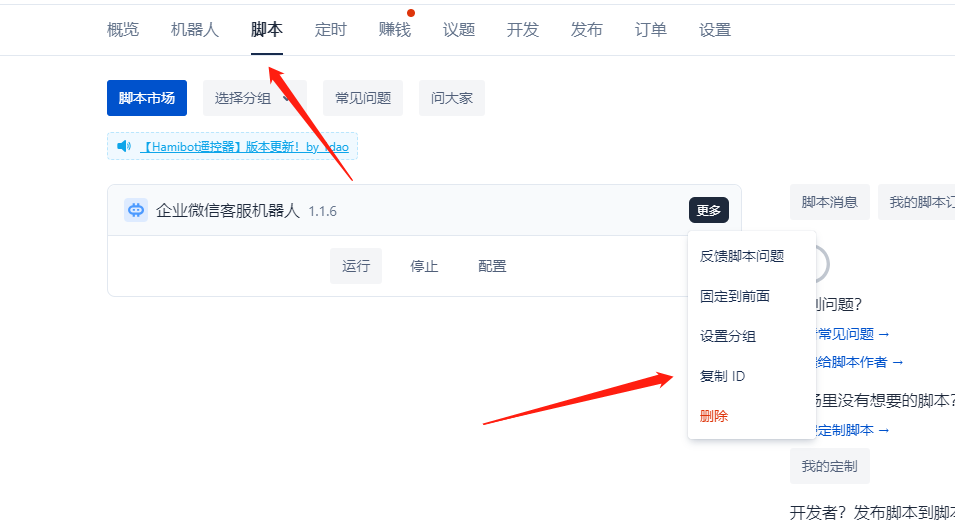
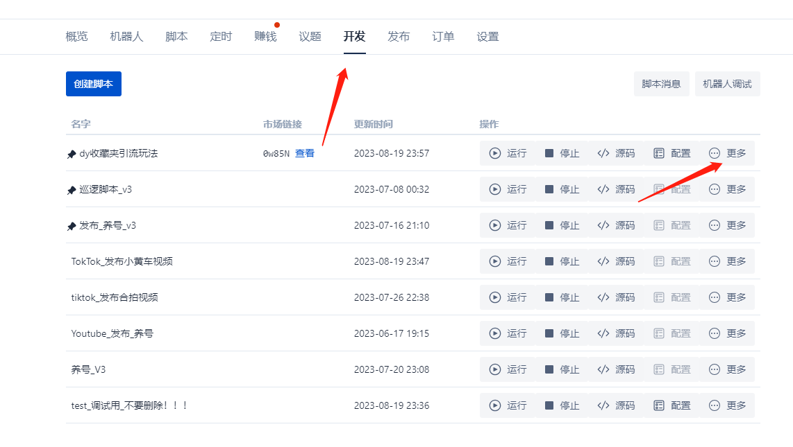
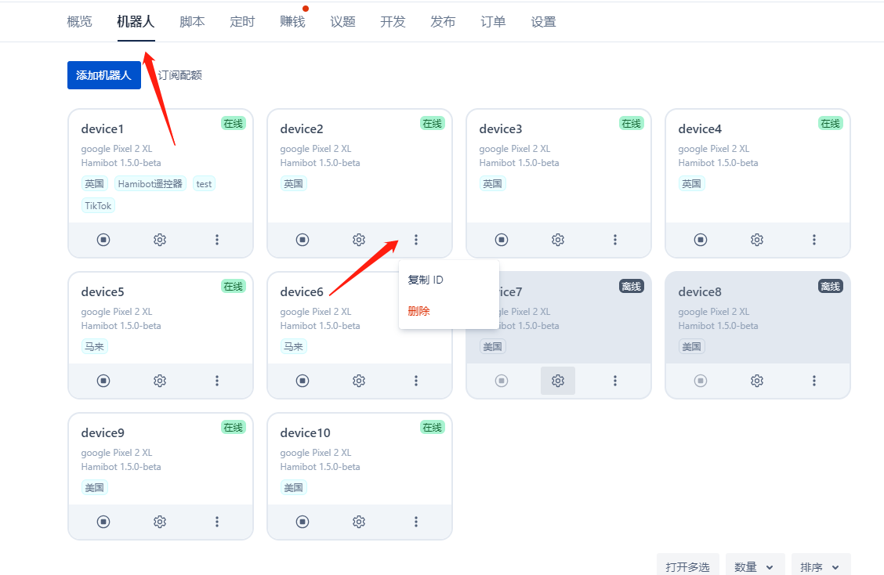
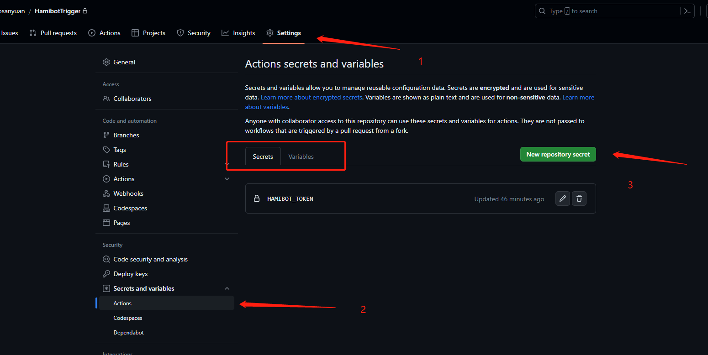
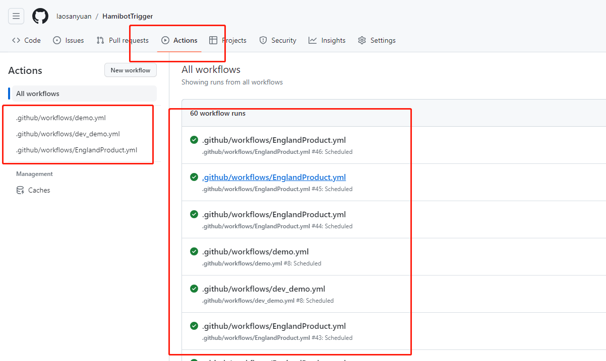

# 脚本功能

本项目基于Github Actions提供的免费CI/CD能力，通过设置yml流程，定时触发执行Hamibot脚本。白嫖Hamibot调用额度。

## Github Actions

 GitHub Actions 是 GitHub 提供的一项持续集成（CI）和持续交付（CD）服务，它允许开发人员自动化软件开发工作流程。通过 GitHub Actions，你可以在代码库中配置自动化的任务和工作流，例如构建、测试、部署和其他操作。  GitHub Actions 是一个强大的自动化工具，使团队能够更轻松地创建、测试和交付代码。

## Hamibot

Hamibot 是一款适用于安卓系统的自动化工具，能操控任意 APP，实现自动化操作，提高工作效率。 

Hamibot为用户每月提供300次免费API调用额度，本项目就是基于这些免费额度来使用的。利用好这些额度，如果按每天执行一次计算，相当于白嫖了10个免费机器人，还是相当香的。

注册地址：https://hamibot.com/referrals/m7ax

# 使用设置

## 必要设置

1. fork本项目到个人仓库。

2. 获取Hamibot Token。

   

3. 获取Hamibot中需要执行的脚本和机器人信息。

    1. 获取脚本id（根据自己要执行的情况选择脚本类别）
      
       * 获取发布市场脚本id：
       
         
       
       * 获取开发脚本id：
       
         
    
    2. 获取机器人id和名称
      
       
    
4. 创建Github Actions流程：复制项目下./.github/workflows/demo.yml，重命名为{任务名}.yml（注意：任务名为自定义的，如test1.yml，后面的配置都以test1标识对应）。

    因为Hamibot中脚本有两类，一类是应用市场中获取的脚本，一类是自行开发的脚本。两类脚本对应的api不同，所以创建流程的时候就需要区分。

    如果你要执行的脚本是从应用市场获取，复制demo.yml。如果你要执行的脚本是自己开发则复制dev_demo.yml。

5. 创建Secrets和Variables：

   

   * 将步骤2中获取的Hamibot Token 添加到Secrets中，名称设置为HAMIBOT_TOKEN。

   * 将步骤3中获取的脚本id和机器人信息新建到Variables中，名称为HAMIBOT_PARAS，内容填入机器人id和名称（后续有流程新增或修改都修改这个文件）。文件格式如下：
     
     ```json
     {
       "test1": {
         "script": "64******5f225387c3",
         "enable": true,
         "robots": [
           {
             "_id": "64757*******9165dd6",
             "name": "device3"
           },
           {
             "_id": "64757*******9165dd7",
             "name": "device4"
           }
         ]
       },
       "test2": {
         "script": "64******5f225387c4",
         "enable": true,
         "robots": [
           {
             "_id": "64757*******9165dd6",
             "name": "device3"
           },
           {
             "_id": "64757*******9165dd7",
             "name": "device4"
           }
         ]
       }
     }
     ```
     
     以上案例表示：
     
     * test1指定给名称为test1.yml的流程使用。
     * script指定运行的脚本id。
     * robots指定运行哪些机器人。机器人配置数量可以自定义，但是要符合上述格式。
     * 如果某个定时不需要使用时，可将enable设置为false，执行时会过滤掉。

6. 设置触发时机

    脚本的触发通过Github Actions来完成，触发的事件点设置在yml流程中。如果需要修改触发的时机，需要修改刚刚新建的yml文件中Schedule部分：

    ```yml
    on:
      schedule:
        - cron: '0 7,9,11,15,17,21,22 * * *'  
    ```

    触发时间通过cron表达式设置，cron表达式语法具体可以参见：

    * https://www.jianshu.com/p/e9ce1a7e1ed1
    * https://cron.qqe2.com/
    
## 设置微信运行报告（可选）

本项设置为可选项，用来在脚本调用失败时，将错误信息通过微信及时通知用户。**如果不设置也不影响脚本运行**。

1. 微信中点击  https://wxpusher.zjiecode.com/wxuser/?type=1&id=51499#/follow  关注公众号。

2. 公众号右下角【我的】获取uid。

3. 【Settings】-【Security】-【Secrets and variables】-【Actions】-【Variables】处，添加变量。名称为【WECHAT_UID】,内容为上步骤获取的uid。

# 查看运行结果

